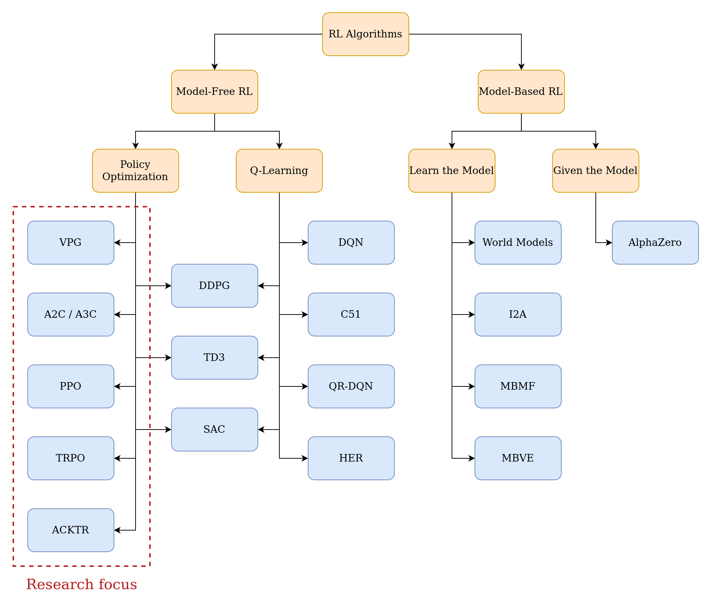
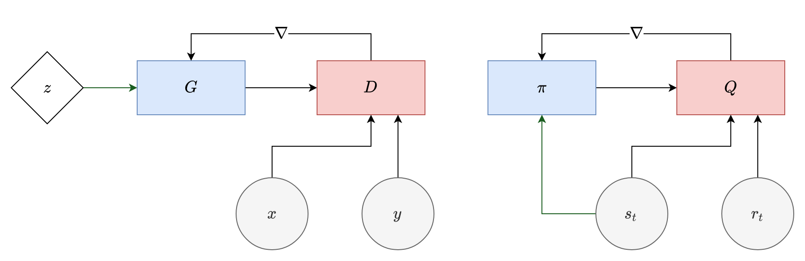
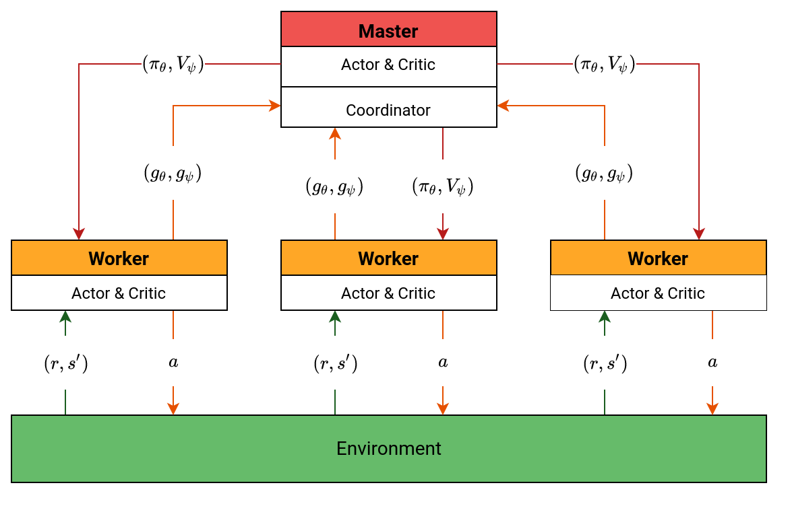
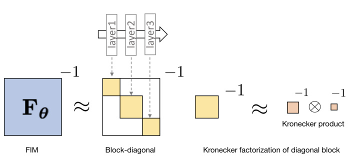
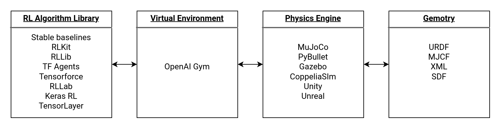
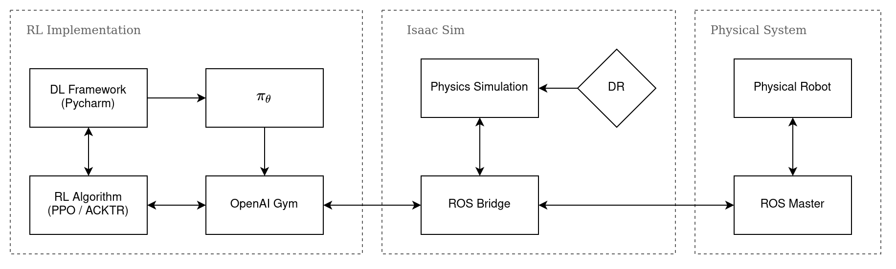
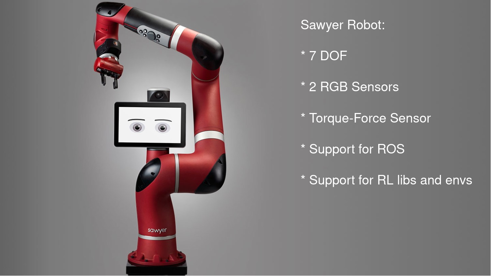
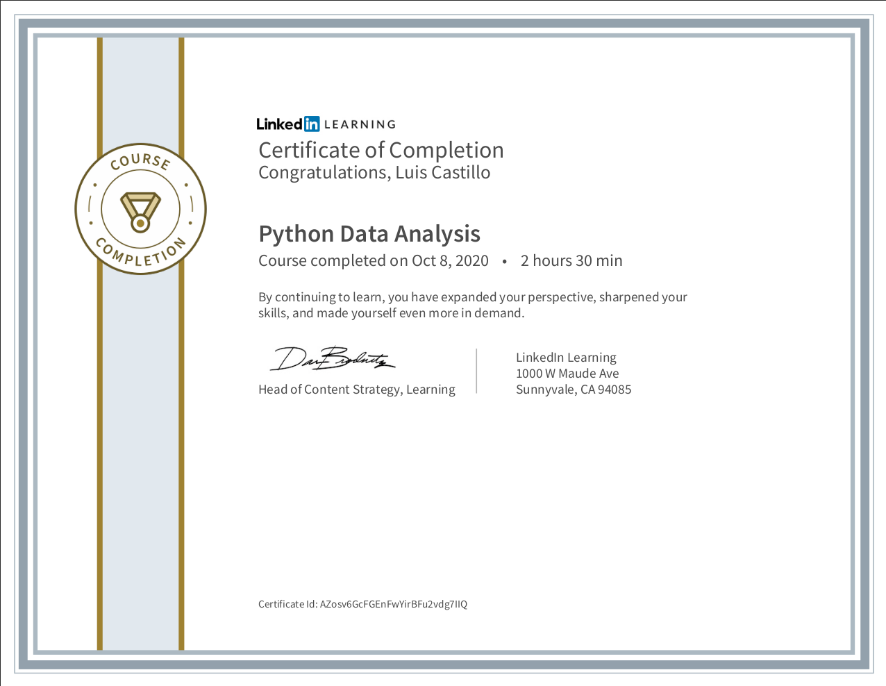
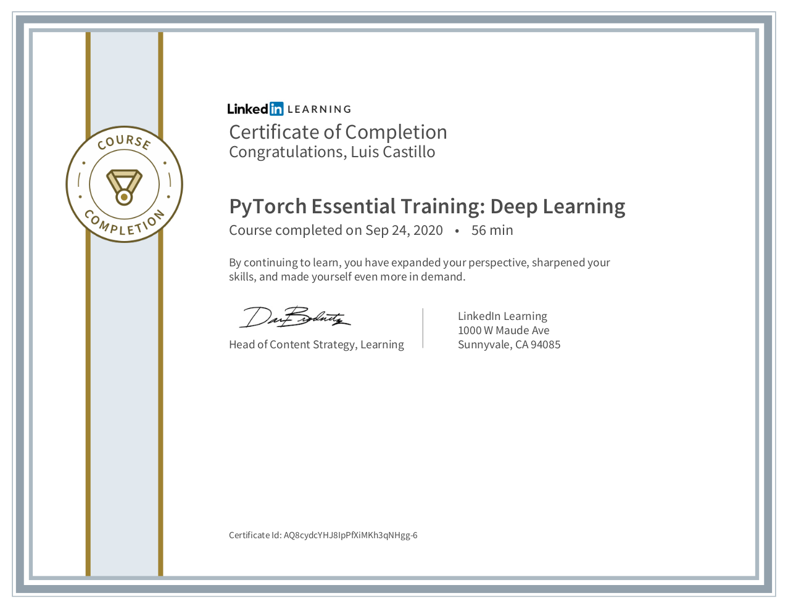
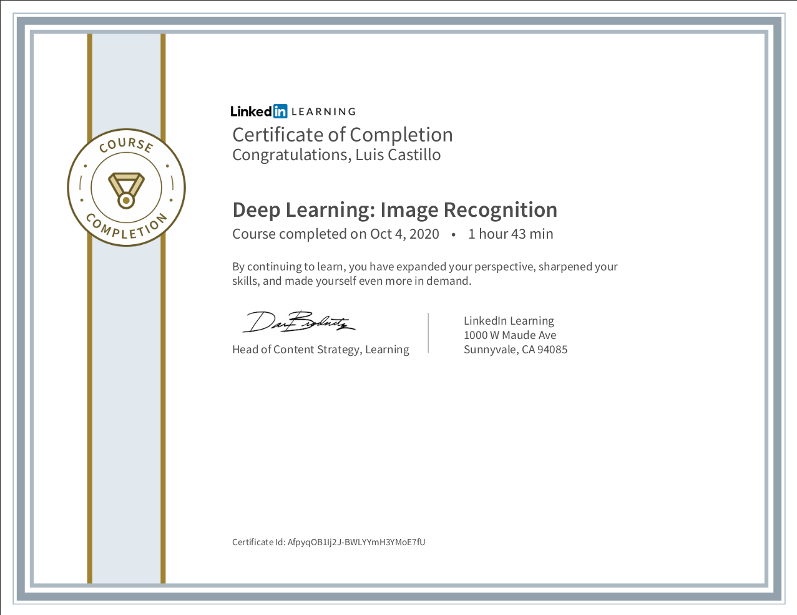

```{r setup, echo=FALSE}
library(knitr)
library(kableExtra)
```


## Presentation outline

* [Policy Gradient Algorithms](#pg)
  + [REINFORCE: Vanilla Policy Gradient](#vpg)
  + [Actor-Critic](#ac)
    - [Synchronous Advance Actor-Critic](#a2c)
    - [Asynchronous Advance Actor-Critic](#a3c)
  + [Trust Region Policy Optimization](#trpo)
  + [Proximal Policy Optimization](#ppo)
  + [Actor Critic Using Kronecker-Factored Trust Region](#acktr)
* [Project Review](#review)
* [Project Strategy](#strategy)
* [Project Status](#status)
* [References](#refs)

## RL Algorithms

```{r rl_algos, echo=F, fig.align='center', out.width='80%'}

```

# Policy Gradient Algorithms {#pg}

## REINFORCE: Vanilla Policy Gradient (VPG) {#vpg}

This algorithm follows the simple idea of performing gradient ascent on the parameters of the $\theta$ policy to gradually improve the performance of the $\pi_theta$ policy

$$
\begin{aligned}
\nabla_{\theta} J\left(\pi_{\theta}\right) &=\mathrm{E}_{\tau \sim \pi_{\theta}}\left[\sum_{t=0}^{T} \nabla_{\theta} \log \pi_{\theta}\left(a_{t} \mid s_{t}\right) \sum_{t^{\prime}=t}^{T} R_{t^{\prime}}\right] \\
&= \mathrm{E}_{\tau \sim \pi_{\theta}}\left[\sum_{t=0}^{T} \nabla_{\theta} \log \pi_{\theta}\left(a_{t} \mid s_{t}\right) Q(a_{t}, s_{t})\right]
\end{aligned}
$$

One interpretation of VPG is to weight the gradient by the cumulative reward of each action, encouraging the agent to take the action $a_i$ that has greater cumulative reward.

##
The policy gradient can be extended to the infinite horizon by adding the discount factor $\gamma$. This, in order to reduce the high variance in the gradient estimation

$$
\nabla J(\theta)=\mathrm{E}_{\tau \sim \pi_{\theta}}\left[\sum_{t=0}^{\infty} \nabla_{\theta} \log \pi_{\theta}\left(a_{t} \mid s_{t}\right) \gamma^{t} \sum_{t^{\prime}=t}^{\infty} \gamma^{t^{\prime}-t} R_{t^{\prime}}\right]
$$

Another way to reduce high variance problems is to add a baseline $b(s_t)$ function that only depends on the state $s_t$

$$
\nabla J(\theta)=\mathrm{E}_{\tau \sim \pi_{\theta}}\left[\sum_{t=0}^{\infty} \nabla_{\theta} \log \pi_{\theta}\left(a_{t} \mid s_{t}\right)\left(\sum_{t^{\prime}=t}^{\infty} \gamma^{t^{\prime}-t} R_{t^{\prime}}-b\left(s_{t}\right)\right)\right]
$$

**Note**: One common choice of $b(s_t)$ is its estimated state value $V(s_t)$

## Actor-Critic (AC) {#ac}
The *actor-critic* method follows the idea of training together an **actor**, the policy function $\pi(a|s)$, and the **critic**, the value function $V^{\pi}(s)$. Like some VPG implementations, AC uses a variant of the *TD error* called *L-step TD error*.

```{r ac_gan, echo=F, fig.align='center', fig.out='100%', fig.cap="Relationship between Actor-Critic (AC) and Generative Adversarial Network (GAN). Black lines are analogous connections between architectures, while green lines are dependent."}

```

## The critic

The **critic**, $V_{\psi}^{\pi}$, is optimized by minimizing the square of the L-step error:

$$
\psi=\psi-\eta_{\psi} \nabla J_{V_{\psi}^{\pi_{\theta}}}(\psi)\\
$$

where $\eta_{\psi}$ is the step size and the function of the L-step error is

$$
J_{V_{\psi}}^{\pi_{\theta}}(\psi) = \frac{1}{2}\left(\sum_{t=i}^{i+L-1} \gamma^{t-i} r_t + \gamma^{L} V_{\psi}^{\pi_{\theta}}(s')-V_{\psi}^{\pi_{\theta}}(s_i)\right)^{2}\\
$$

where $s'$ is the next state after $L$ steps following the policy $\pi_{\theta}$.

##
And the gradient $\nabla J_{V_{\psi}}(\psi)$ is

$$
\nabla J_{V_{\psi}^{\pi_{\theta}}}(\psi)=\left(V_{\psi}^{\pi \theta}\left(S_{i}\right)-\sum_{t=i}^{i+L-1} \gamma^{t-i} R_{t}-\gamma^{L} V_{\psi}^{\pi \theta}\left(S^{\prime}\right)\right) \nabla V_{\psi}^{\pi \theta}\left(S_{i}\right)
$$

## The actor

Similarly the **actor**, $\pi_{\theta}(\cdot)$, takes the state $s$ as input and the output is the policy or action. To update this function, similar to the VPG algorithm, the gradient ascent is used

$$
\theta = \theta + \eta_{\theta} \nabla J_{\pi_{\theta}}(\theta)\\
$$

where $\eta_{\theta}$ is the step size and the gradient $\nabla J_{\pi_{\theta}}(\theta)$ is

$$
\nabla J(\theta)=\mathbb{E}_{\tau, \theta}\left[\sum_{i=0}^{\infty} \nabla \log \pi_{\theta}\left(A_{i} \mid S_{i}\right)\left(\sum_{t=i}^{i+L-1} \gamma^{t-i} R_{t}+\gamma^{L} V_{\psi}^{\pi \theta}\left(S^{\prime}\right)-V_{\psi}^{\pi_{\theta}}\left(S_{i}\right)\right)\right]
$$

## Note about AC

It should be noted that the parameters of the actor $(\theta)$ and the critic $(\psi)$ are not necessarily different, in practice some authors share the lower layers of both networks as a representation of the state. Furthermore, in practice $L$ is used with a value of 1, which gives us a TD(1) estimate.

## Synchronous Advance Actor-Critic (A2C) {#a2c}

A2C is similar to the AC algorithm, but is focused on parallel training. In this architecture there is a master node in charge of updating the model of the actor and the critic, while the working nodes are in charge of generating the experience with the interaction with the environment

<!-- Each worker has a copy of the global actor and critic and uses them to interact with the environment, sampling actions using the policy, and then estimating the gradients of the target function for each model. Once the master node receives all the gradients, in a synchronous way, it uses them to update the parameters, and update the global actor and critics. -->

```{r ac2, echo=F, fig.align='center', out.width='65%', fig.cap="Schematic diagram of A2C architecture"}

```

## Asynchronous Advance Actor-Critic (A3C) {#a3c}

A3C is just an asynchronous version of A2C. This means that the master node no longer waits for all workers to report to it to update the parameters of the models $(\pi_{\theta}, V_{\psi})$, but rather, the update takes place every time a worker reports the calculation of new gradients, this makes the computational efficiency better compared to A2C

```{r ac3, echo=F, fig.align='center', fig.cap="Comparative between A2C and A3C architectures"}
include_graphics("images/ac2_vs_ac3.png")
```

## PG Problems (1/2): Step size pitfall

Both VP and AC use stochastic gradient descent (SGD), which makes them susceptible to **performance collapse** if the step size $\eta_{\theta}$ is too large.

This happens because the gradient $\nabla J(\theta)$ only provides **first-order information** of the current $\theta$ parameters. Ignoring completely the **curvature** that has the reward history obtained.

But, if the step size $\eta_\theta$ is too small, learning can become very conservative and make no progress in training.

## PG Problems (2/2): Parametric space vs. Policy space

Another limitation of VPO and Actor-critic is that they operate in the parametric space rather than the political space

$$
\Pi = \left\{ \pi | \pi \geq 0, \, \int \pi = 1 \right\}\\
$$

This makes it more difficult to adjust the parameter of step size $\eta_{\theta}$ because a small change in the parametric space $\theta$ can mean a very **abrupt change** in the policy $\pi_{\theta}$.

## Trust Region Policy Optimization (TRPO) {#trpo}

TRPO solves the problem of step size, while maintaining control of variance between learned policies and also operating in the policy space.

To achieve this, TRPO performs the update of parameters of the policy $\pi_\theta$ solving the following optimization problem:

$$
\begin{aligned}
\max_{\pi_{\theta}} &\; \mathcal{L}(\pi_{\theta}') \\
\text{ s.t. } &\; \mathrm{E}_{s \sim \rho_{\pi_{\theta}}} \left[ D_{KL}(\pi_{\theta} \| \pi_{\theta}') \right] \leq \delta
\end{aligned}\\
$$

where $D_{KL}(\pi_{\theta} \| \pi_{\theta}')$ is the KL-divergence, a measure of relative entropy between the old and new policy $(\pi_{\theta}, \pi_{\theta}')$, and $\mathcal{L}(\pi_{\theta}')$ is the surrogate advantage, a performance metric between policies.

##
The surrogate advantage is

$$
\mathcal{L}(\pi_{\theta}') = \mathrm{E}_{\tau \sim \pi_{\theta}}\left[\sum_{t=0}^{\infty} \gamma^{t} \frac{\pi_{\theta}^{\prime}\left(a_{t} \mid s_{t}\right)}{\pi_{\theta}\left(a_{t} \mid s_{t}\right)} A^{\pi_{\theta}}\left(s_{t}, a_{t}\right)\right] \\
$$

And the gradient

$$
g = \nabla_{\theta} \mathcal{L}(\pi_{\theta}') = \mathrm{E}_{\tau \sim \pi_{\theta}}\left[\left.\sum_{t=0}^{\infty} \gamma^{t} \nabla_{\theta} \log \pi_{\theta}\left(A_{t} \mid S_{t}\right)\right|_{\theta} A^{\pi_{\theta}}\left(S_{t}, A_{t}\right)\right]
$$

##
Using Taylor's expansion, we can approximate

$$
\begin{aligned}
\mathcal{L}(\pi_{\theta}') & \approx g^{T}\left(\theta'-\theta\right) \\
\bar{D}_{K L}\left(\theta' \| \theta\right) & \approx \frac{1}{2}\left(\theta' -\theta\right)^{T} H\left(\theta'-\theta\right)
\end{aligned}\\
$$

where $H$ is the Hessian of $\mathrm{E}_{s \sim \rho_{\pi_{\theta}}} \left[ D_{KL}(\pi_{\theta} \| \pi_{\theta}') \right]$

##
Thus, the optimization problem is reduced to

$$
\begin{aligned}
\theta' &= \arg \max \; g^{T}(\theta'-\theta) \\ \\
& \text{ s.t. } \; \frac{1}{2} (\theta' - \theta)^{T} \, H(\theta'-\theta) \leq \delta
\end{aligned}\\
$$

which has an analytical solution (with the method of the Lagrangian duality)

$$
\theta'=\theta+\sqrt{\frac{2 \delta}{g^{T} H^{-1} g}} H^{-1} g\\
$$

##
By doing this, TRPO would be calculating the Natural Gradient (NG). But, because of the errors induced by the approximations, this solution may not satisfy the KL-divergence restriction. To solve that, TRPO uses line search

$$
\theta'=\theta+\alpha^{j} \sqrt{\frac{2 \delta}{g^{T} H^{-1} g}} H^{-1} g\\
$$

**Note**: Because of the costo of computing $H^{-1}$, TRPO uses the conjugate gradient method to solve $Hx = g$ for $x = H^{-1}g$.

$$
H x=\nabla_{\theta}\left(\left(\nabla_{\theta} \bar{D}_{K L}\left(\theta \| \theta_{k}\right)\right)^{T} x\right)\\
$$

## Proximal Policy Optimization (PPO) {#ppo}

* PPO, like TRPO, takes the greatest possible step without causing policy performance collapse

* But, while TRPO uses second order information, the PPO only uses first order information, which brings performance improvements and simplifies implementation.

* There are mainly two variants of PPO:
  + PPO-Penalty
  + PPO-Clip

## PPO-Penalty {#ppo-penalty}

Instead of solving an optimization problem with constraints, as TRPO does, PPO-Penalty solves a regularization problem

$$
\max_{\pi_{\theta}'} \; \mathcal{L}(\pi_{\theta}') - \lambda \, \mathrm{E}_{s \sim \rho_{\pi_{\theta}}} \left[ D_{KL}(\pi_{\theta} \| \pi_{\theta}') \right]
$$

where $\lambda$ is the adjustment coefficient, this parameter is adjusted based on the KL-divergence during training.

## PPO-Clip {#ppo-clip}

PPO-Penalty does not contain the KL-divergence term. It directly clips on the reason for change between policies $\ell(\theta')$

$$
\mathcal{L}(\pi_{\theta}') = \mathrm{E}_{\pi_{\theta}} \left[ \min \left( \ell_{t}(\theta') A^{\pi_{\theta}}(s_t, a_t), \, \text{clip}(\ell_{t}(\theta'), 1 - \epsilon, 1 + \epsilon) A^{\pi_{\theta}}(s_t, a_t) \right) \right] \\
$$

whit

$$
\ell_t(\theta') = \frac{\pi_{\theta}'(a_t, s_t)}{\pi_{\theta}(a_t, s_t)} \\
$$

and

$$
\text{clip}(x, \min, \max) = \left\{ \begin{array}{lc} \text{if } x > \max & \max \\
\text{if } x < \min & \min \\ \text{otherwise} & x\end{array} \right.
$$

## Actor Critic Using Kronecker-Factored Trust Region (ACKTR) {#acktr}

* ACKTR is another alternative to TRPO. Its main idea is to use K-FAC, a very efficient second-order optimization method for calculating natural gradient descent (NGD).

* While TRPO approximates the inverse of the Hessian $H^{-1}$ with the conjugate gradient $H^{-1}g$, ACKTR approximates it with a diagonal block matrix, where each block corresponds to Fisher Information Matrix (FIM) of each layer in the model.

## K-FAC

```{r acktr, echo=F, fig.align='center', fig.cap="FIM aproximation using K-FAC"}

```

##

For each layer $\ell$, with output $x_{\text{out}} = W_{\ell} \, x_{\text{in}}$ and $W_{\ell}$ a matrix of dimensions $d_{\text{in}} \times d_{\text{in}}$. The idea is to use Kronecker's factorization to calculate the gradient $\nabla_{W_{\ell}}$ with the product of $(\nabla_{x_{\text{out}}L)x_{\text{in}}}$

$$
\left(\nabla_{\theta} \log \pi_{\theta}(a \mid s)\right)\left(\nabla_{\theta} \log \pi_{\theta}(a \mid s)\right)^{\top}=x_{\text {in }} x_{\text {in }}^{\top} \otimes\left(\nabla_{x_{\text {out }}} L\right)\left(\nabla_{x_{\text {out }}} L\right)^{\top}
$$

where $\otimes$ denotes Kronecker product.

##
In this way To approach $H^{-1}$ as

$$
\begin{aligned}
H^{-1} =&\left(\left(\nabla_{\theta} \log \pi_{\theta}(a \mid s)\right)\left(\nabla_{\theta} \log \pi_{\theta}(a \mid s)\right)^{\top}\right)^{-1} \\
=&\left(x_{\text {in }} x_{\text {in }}^{\top} \otimes\left(\nabla_{x_{\text {out }}} L\right)\left(\nabla_{x_{\text {out }}} L\right)^{\top}\right)^{-1} \\
=&\left[\left(x_{\text {in }} x_{\text {in }}^{\top}\right)^{-1} \otimes\left(\left(\nabla_{x_{\text {out }}} L\right)\left(\nabla_{x_{\text {out }}} L\right)^{\top}\right)^{-1}\right]
\end{aligned}\\
$$

With this, instead of inverting a matrix of $(d_{\text{in}}^3 d_{\text{out}}) \times (d_{\text{in}} d_{\text{out}})$, the result can be approximated by the inversion of two matrices of dimensions $d_{\text{in}}^3 \times d_{\text{in}}^3$ and $d_{\text{out}}^3 \times d_{\text{out}}^3$.

# Project review {#review}

## Hypothesis {#hypothesis}

> If we randomly modify the dynamics of a simulation environment in order to learn a robust control policy for solving a dexterous manipulation task, then it is possible to transfer this learned policy to a physical robot and solve the task with little or any fine-tuning.

## General objective {#objectives}
The general objective of this thesis project is:

* Train an agent in simulation to solve a specific dexterous manipulation task using reinforcement learning algorithms with domain randomization techniques and then transfer the learned policy to a physical robot.

## Specific objectives
The following objectives emerge from the main objective of this research:

```{r objetives, echo=FALSE}
# Read in data
df <- read.csv("thesis-activities.csv", stringsAsFactors = FALSE)
# Convert to dates
df$Start <- as.Date(df$Start, format = "%d/%m/%Y")
# Create table
# kable(df, booktabs = TRUE)
kbl(df) %>% kable_minimal(c("striped", "hover"))
```

# Project Strategy {#strategy}

## RL Algorithm
As the results show, the most promising algorithms for the type of task this project seeks to solve are:

* **PPO**: Is stable, its implementation is simple, it allows working with complex action spaces, it is scalable and it has optimized and parallel implementations.

* **ACKTR**: Is both sample and computationally efficient, uses second-order information, uses the natural gradient.

## Virtual Environment

```{r env_pipe, echo=F, fig.align='center', fig.out='100%', fig.cap="Common pipline for training Rl robotics agents"}

```

## Nvidia Isaac Sim

In June 2020 Nvidia released early access to its new robot simulation platform. This software features a realistic physics simulator optimized to work with GPUs, high image fidelity with Nvidia's ray tracing and path tracing technology, as well as ROS connectivity and full Python support.

<center>
  <video data-autoplay src="videos/isaac_sim.m4v" loop="loop" width="720" height="405"></video>
</center>

##
The complete list of features of Nvidia Isaac Sim is:

* Rigid Body Dynamics
* Destructible Environments
* Soft Body Simulation
* Gripper Simulation
* Robust and Precise Articulated Dynamics
* Sensors Simulation (LIDAR, Camera)
* Warehouse Simulation
* Dynamic motion Planning
* Scalable Simulations
* STR Path Planning
* Support for Domain Randomization
* ROS Bridge

## Experimental Platform

```{r impl, echo=F, fig.align='center', out.width='120%', fig.cap=""}

```

## Physical Robot

```{r sawyer, echo=F, fig.align='center', out.width='80%', fig.cap=""}

```


**Note**: Due to the pandemic, it is intended to work as much as possible with the virtual environments and leave as a secondary objective to work with the physical robot.

## Task to solve

It is proposed to solve some goal based task that requires a certain degree of precision to solve. The proposed tasks to be solved are: **Reaching, pick and place and pushing an object**.

<!-- It is also necessary to consider the limitations of the simulation (simulation of sensors, dynamics of the task) and those of the hardware (sensors, tools). With this in mind, some of  -->

<video data-autoplay src="videos/fetch_reach.mp4" loop="loop" width="280" height="280"></video>
<video data-autoplay src="videos/fetch_pick_and_place.mp4" loop="loop" width="280" height="280"></video>
<video data-autoplay src="videos/fetch_push.mp4" loop="loop" width="280" height="280"></video>

# Project Status {#status}

## Course in Python Data Analysis

```{r cert1, echo=F, fig.align='center', out.width='75%', fig.cap=""}

```

## Course in Deep learning with PyTorch

```{r cert2, echo=F, fig.align='center', out.width='75%', fig.cap=""}

```

## Course in Image Recognition with DL

```{r cert3, echo=F, fig.align='center', out.width='75%', fig.cap=""}

```

## Check list

```{r done, echo=FALSE}
# Create table
kbl(df) %>%
  kable_minimal(c("hover")) %>%
  row_spec(1:2, color = "white", background = "#4caf50") %>%
  row_spec(3, color = "black", background = "#ffc107") %>%
  row_spec(4:6, color = "black", background = "#ff8f00")
```

## Chronogram of activities

```{r activities_chart, echo=FALSE, message=FALSE, warning=FALSE}
library(plotly)

# # Read in data
# df <- read.csv("thesis-activities.csv", stringsAsFactors = FALSE)
# # Convert to dates
# df$Start <- as.Date(df$Start, format = "%d/%m/%Y")

# Choose colors based on number of resources
cols <- RColorBrewer::brewer.pal(length(unique(df$Type)), name = "Set2")
df$color <- factor(df$Type, labels = cols)

# Initialize empty plot
fig <- plot_ly()

# Each task is a separate trace
# Each trace is essentially a thick line plot
# x-axis ticks are dates and handled automatically
for(i in 1:nrow(df)){
 fig <- add_trace(fig,
                 x = c(df$Start[i], df$Start[i] + df$Duration[i]),  # x0, x1
                 y = c(nrow(df)-i+1, nrow(df)-i+1),  # y0, y1
                 mode = "lines",
                 line = list(color = df$color[i], width = 20),
                 showlegend = FALSE,
                 hoverinfo = "text",
                 # Create custom hover text
                 text = paste("Task: ", df$Task[i], "<br>",
                              "Duration: ", df$Duration[i], "days<br>",
                              "Type: ", df$Type[i]),
                  evaluate = TRUE  # needed to avoid lazy loading
  )
}

# Add information to plot and make the chart more presentable
fig <- layout(fig,
            # Axis options:
            # 1. Remove gridlines
            # 2. Customize y-axis tick labels and show task names instead of numbers
            xaxis = list(showgrid = TRUE, tickfont = list(color = "#000000")),
            yaxis = list(showgrid = TRUE, tickfont = list(color = "#000000"),
                         tickmode = "array", tickvals = nrow(df):1, ticktext = unique(df$Task),
                         domain = c(0, 0.9)),
            width=900, height=600,
            legend=list(orientation='h')
            )
fig
```

# References {#refs}

##
<div id="refs" style="width: 1000px; height: 600px; overflow-y: scroll;"></div>

##
<br>
<center>
  <h1>Thank you for your attention ☕</h1>
</center>