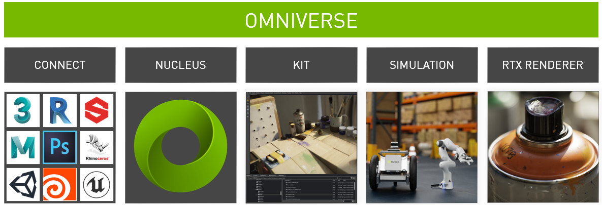
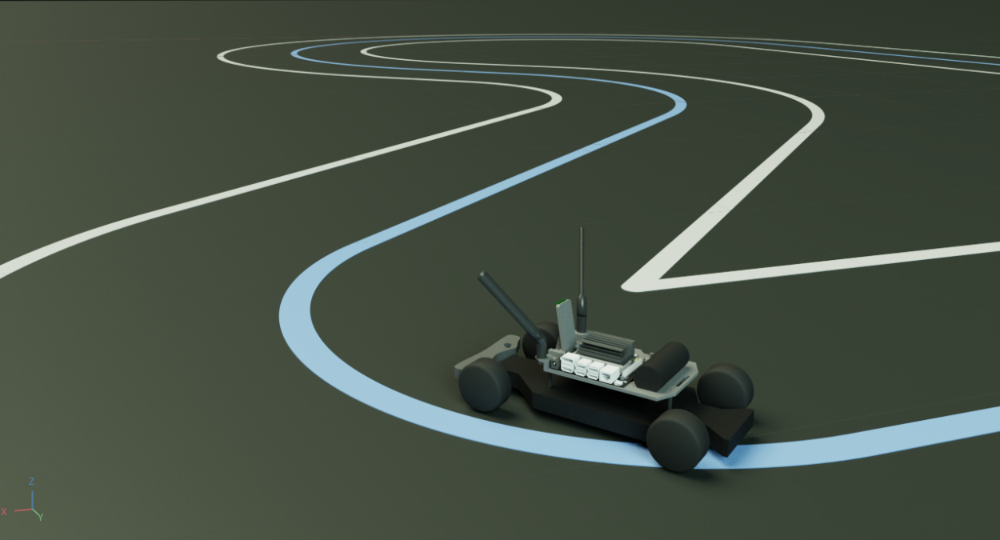
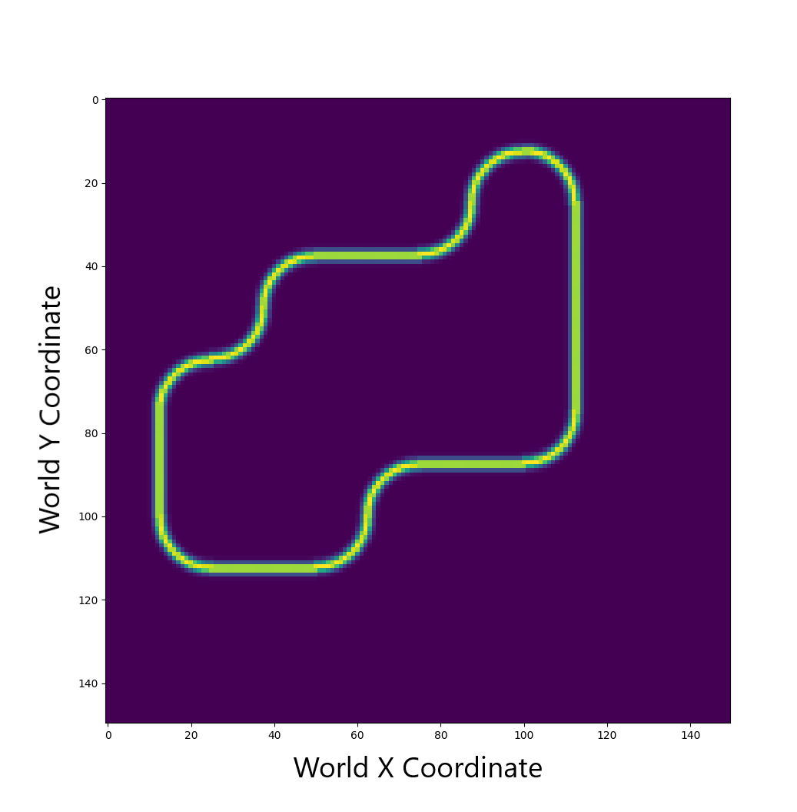
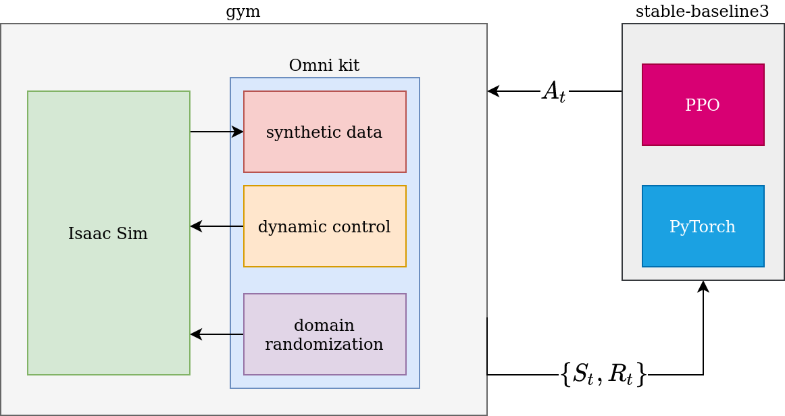
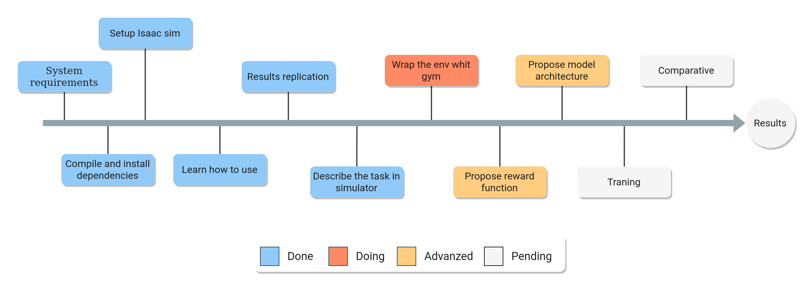

```{r setup, include=FALSE}
knitr::opts_chunk$set(echo = TRUE)
library(knitr)
library(kableExtra)
```

## Presentation outline

-   [Quick review](#quick_review)
    -   [Hypothesis](#hypothesis)
    -   [General objective](#general_objective)
    -   [Specific objectives](#specific_objectives)
-   [Simulator](#simulator)
-   [Case of study](#case_study)
-   [Task to solve](#task)
    -   [Task description](#task_des)
    -   [Proposal solution](#proposal_sol)
    -   [Implementation status](#current_status)
-   [References](#references)

# Quick review {#quick_review}

## Hypothesis {#hypothesis}

> If we train a Deep RL model in a virtual environment where the physics are randomly modified, then it is possible to solve a specific dexterous manipulation task with a robotic system.

## General objective {#general_objective}

The general objective of this thesis project is:

-   Train a robotic agent in simulation to solve a specific dexterous manipulation task using DNN model trained with reinforcement learning algorithms and domain randomization techniques.

## Specific objectives {#specific_objectives}

In order to achieve the main objective, the following specific objectives are considered:

1.  Train a DDN-based model with the PPO [@schulman2017] algorithm in a **virtual environment** with domain randomization, using a full-state observation.

2.  Same as above, but this time using a partial observation of the environment (RGB images).

# Simulator {#simulator}

## NVIDIA Isaac Sim

The Isaac Sim is powered by the NVIDIA Omniverse, a platform for real-time simulation and 3D production pipelines with support for multi-GPU.

**Specs**:

-   Navigation and manipulation applications
-   Support for Isaac SDK and ROS
-   RGB-D, Lidar and IMU sensors
-   Domain Randomization
-   Ground truth labeling, segmentation, and bounding boxes

## Examples: Isaac Sim

<table>
<tbody>
<tr>
<td>
<div>
<p>Robotic manipulation</p>
<video data-autoplay src="videos/isaac_main_fill_bin.m4v" loop="loop" width="440" height="247"></video>
</div>
</td>
<td>
<div>
<p>Domain Randomization</p>
<video data-autoplay src="videos/isaac_dr.m4v" loop="loop" width="440" height="247"></video>
</div>
</td>
</tr>
</tbody>
</table>

## How it Works

Omniverse consists of 5 key components: Connect, Nucleus, Kit, Simulation and RTX. These components are distributed in a microservices architecture.



## Omniverse pipeline


# Case of study: Nvidia Jetracer {#case_study}

In order to be proficient in the use of the Omniverse platform and the training of Deep RL models in simulation. I follow the documentation to recreate one of the RL training samples.

{width="70%"}

## Task description

The Nvidia JetRacer is an autonomous AI race-car powered by a Jetson Nano. The idea is to train an agent in simulation to follow the center lane using the camera image as observation.

|                                                  |                                        |
|--------------------------------------------------|----------------------------------------|
| **Environment**                                  | **Observation**                        |
| {width="50%"} |  |

-   $A \in \mathbb{R}^2$: motors velocity (steering and forward).
-   $O \in \mathbb{R}^{224 \times 224 \times 3}$: RGB images from front camera.

## Reward function

The reward returned for the environment is:

$$
R = \dot{x} e^{\frac{-x^{2}}{\sigma^{2}}}
$$

Where $\dot{x}$ is the current velocity of the Jetracer, $x$ is the shortest distance from the robot to the center line of the track, and $\sigma$ is a hyper parameter.

## Model

<!-- The input of the model is an image of $224 \times 224$ RGB image scaled to $[0,1]$. -->

<!-- This images are generated by the camera in simulation after $n$ steps. -->

<!-- During each step, the physics engine process the physical contacts and the RTX component render the images. -->


## Training



## Results (1/2)

```{r res, echo=FALSE, message=FALSE}
library(tidyverse)

# load the tensorboard results
reward <- read.csv("data/jetracer/run-PPO_0-tag-eval_mean_reward.csv")

# sd above and bellow the data
reward$MinR <- reward$Value - sd(reward$Value, na.rm = TRUE)
reward$MaxR <- reward$Value + sd(reward$Value, na.rm = TRUE)

g <- ggplot(reward, aes(x = Step, y = Value)) +
  geom_ribbon(aes(ymin = MinR, ymax = MaxR), alpha = 0.5,
              fill = "darkseagreen3", color = "transparent") +
  geom_line(color = "aquamarine4", lwd = 0.7) +
  scale_x_continuous(name="Steps",
                     breaks = seq(1, 27, by=3) * 1e4,
                     labels = scales::number_format(scale = 0.001, suffix = "k")
                     ) +
  scale_y_continuous(name = "Reward",
                     labels = scales::number_format(scale = 0.001, suffix = "k")
                     ) +
  labs(title = "Mean Reward")
g
```

## Results (2/2)

After around 200k steps, we see the agent starting to follow the center lane. Even with the changes of light and the random distractors.

<table>
<tbody>
<tr>
<td>
<div>
<video data-autoplay src="videos/jetracer/jetracer_results-125-149_encoded.m4v" loop="loop" width="440" height="362">
</div>
</td>
<td>
<div>
<video data-autoplay src="videos/jetracer/jetracer_results-74-100_encoded.m4v" loop="loop" width="440" height="362"></video>
</div>
</td>
</tr>
</tbody>
</table>


# Task to solve {#task}

## Task description {#task_des}

The Franka Panda is a serial robot with 7 DOF. The idea is to train an agent to stack the blocks in a tower, without throwing any block.

|                                     |                                     |
|-------------------------------------|-------------------------------------|
|  |  |
|  |  |

## Proposal solution {#proposal_sol}

In order to solve the task using the same framework and tools. The following are proposed:

1. Train the agent using a **full-satate observation**, using all available information (position, velocity) as input for a less complex network architecture, but using the same training method (PPO).

2. Train the agent using **partial-state observation**, that is the image of one or two cameras in the environment, using a similar architecture to the Jetracer example and PPO.

## Current status {#current_status}



# References {#references}

##
::: {#refs style="width: 1000px; height: 600px; overflow-y: scroll;"}
:::

##

<br>
<center>
  <h1>
    Thank you for your attention ☕
  </h1>
</center>