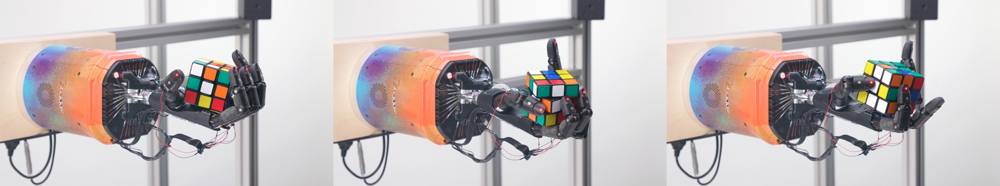
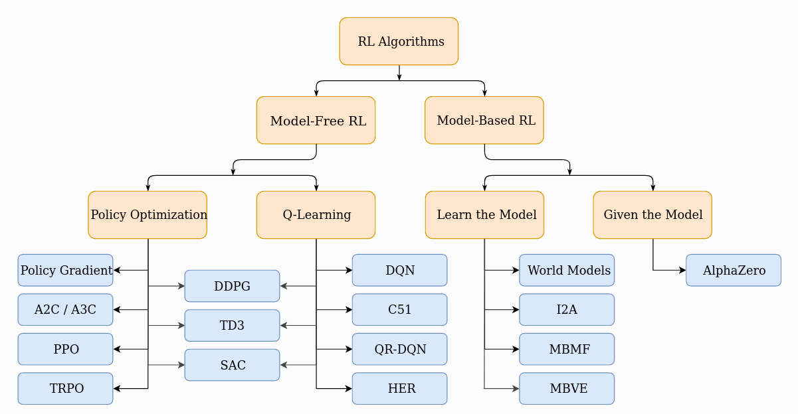
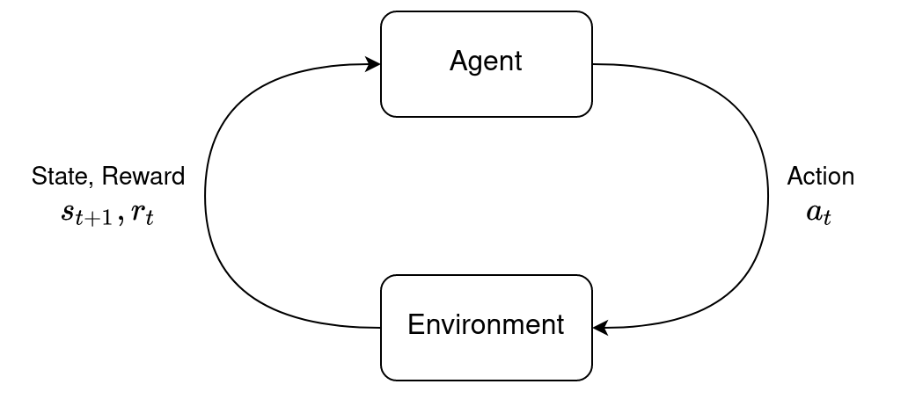
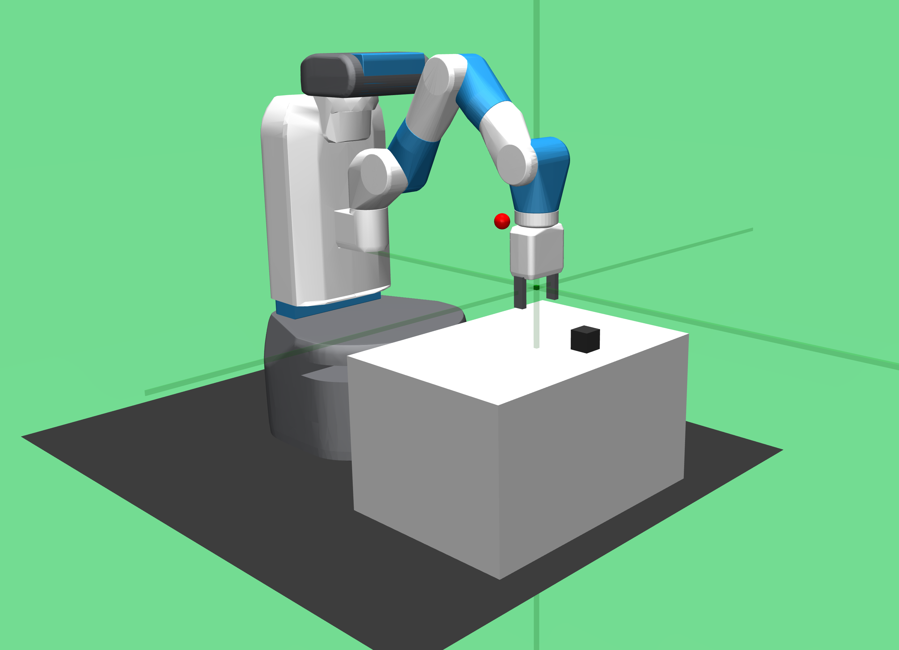
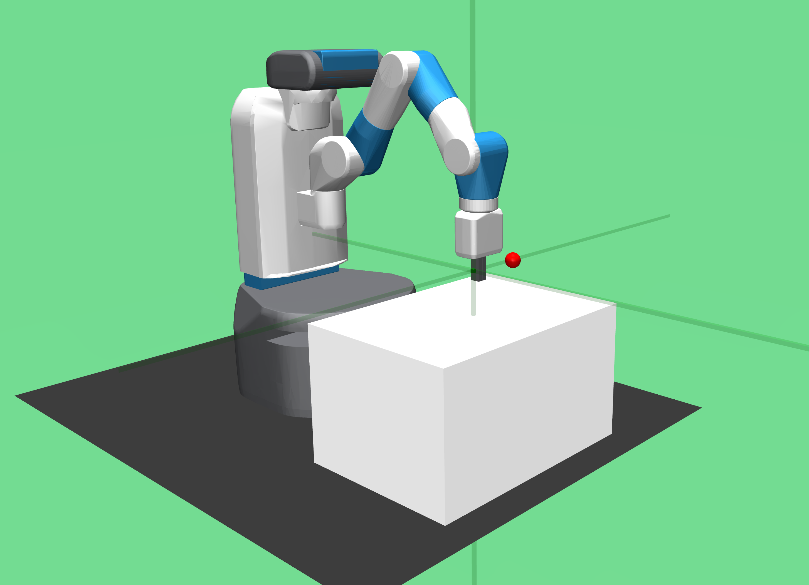
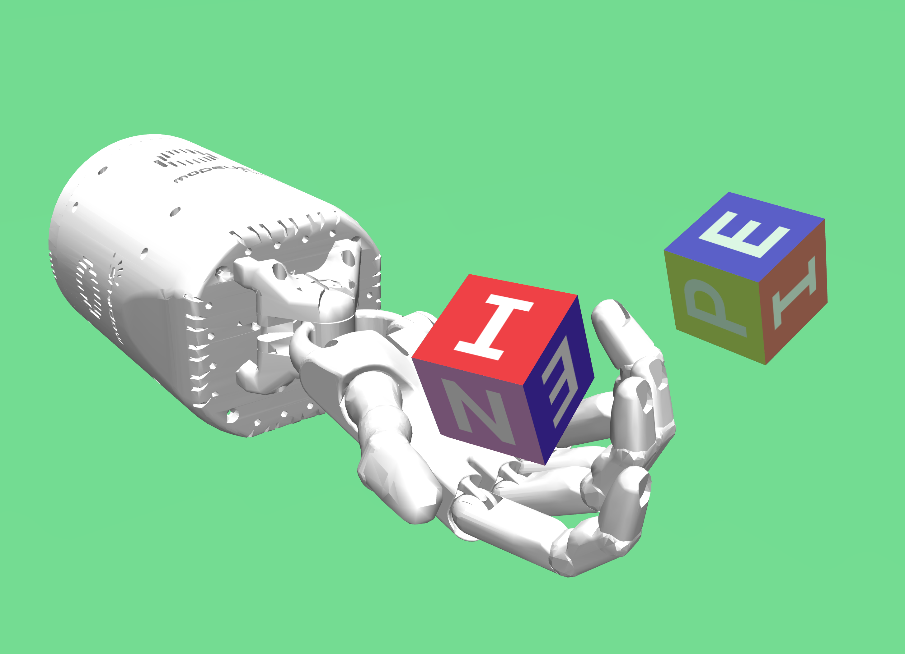
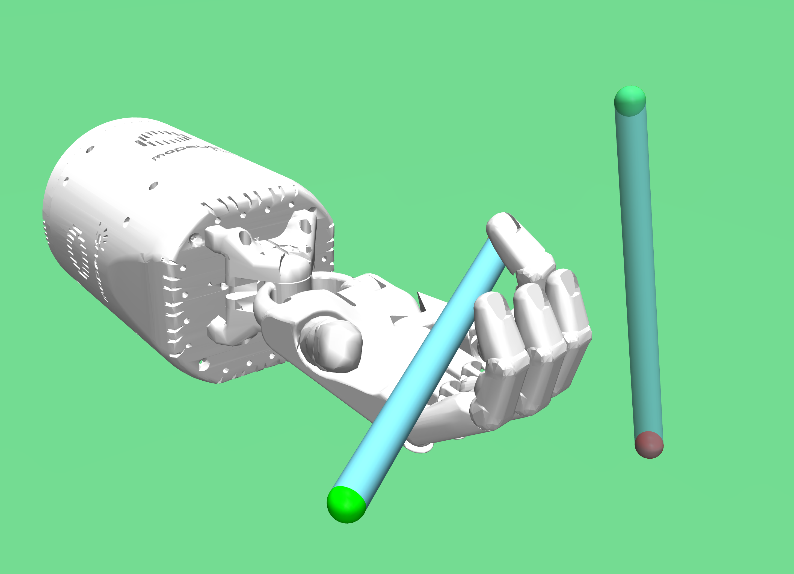
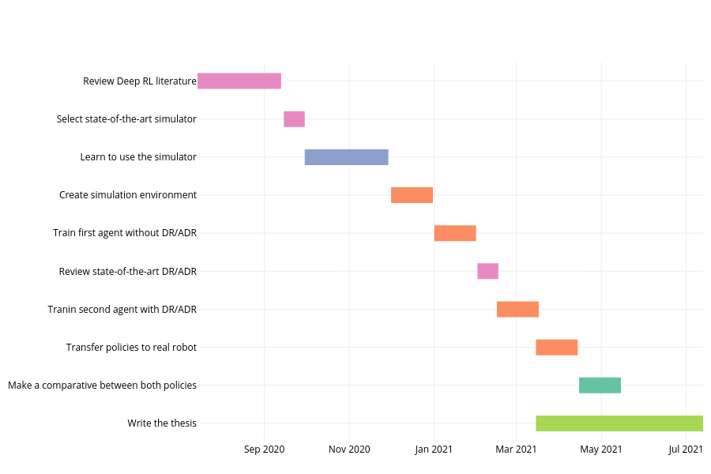

```{r setup, echo=FALSE}
library(knitr)
# library(kableExtra)
opts_chunk$set(echo = TRUE)
```

\newpage
\tableofcontents
\newpage
\listoffigures
\listoftables
\newpage

# Introduction {#intro}

Deep Reinforcement Learning (DRL) is one of the branches of Machine Learning (ML) that has advanced the most recently, and has shown that it can solve complex problems with a superior performance than humans in some tasks, e.g., classic arcade games @mnih2013playing, complicated board games [@silver2016mastering; @silver2017mastering] and massively multiplayer online games @OpenAI_dota.

All these achievements have been possible by combining the best virtues of two areas of ML, on the one hand the versatility of Reinforcement Learning (RL) to frame complex problems as a continuous interaction between an agent and the environment that surrounds it, and on the other side the great advances of Deep Learning (DL) to learn from high-dimensional data. With this, it has been possible and inevitable to replicate these same results in other areas, such as robotics. They have achieved this by using deep neural networks (DNN) to approximate a function that is later used in the agent's training to solve a task through experience. However, most of these methods require a large amount of data to complete the training with acceptable results, this means collecting a large amount of experience with the robot. And doing this with a physical robot means hundreds of hours of supervised work, which makes it impractical in most cases. Other researchers @gu2017deep have chosen to use multiple robots to accelerate training in parallel with good results, but not all research centers have the resources to make this training possible. Another alternative to speed up training is to teach by example, that is, to provide the agent with some examples of experts to solve the task, the drawback is that in some tasks it is difficult to capture this data in real life.

Another very attractive approach is to use a physics simulator to generate a virtual environment that resembles the real environment and train the agent there, the problem with this is that simulators do not fully reflect the complexity of the real world, this problem is known as the "reality gap". However, some researchers have shown that it is possible to overcome this barrier, modifying the dynamics of the simulator randomly [@peng2018sim; @openai2018learning; @akkaya2019solving] obtaining very good results training in a virtual environment and then transferring this knowledge to physical robot, i.e., sim-to-real.

```{r rubik_cube, echo=FALSE, fig.align='center', fig.pos='H', fig.cap='Five-fingered humanoid hand trained with DRL and DR solving a Rubik’s cube'}

```


# State-of-the-art {#sota}

## Model-Free RL
In RL there are different approaches and various algorithms with their own strengths and weaknesses. The figure \ref{fig:rl_algos} shows a diagram with the taxonomy of the main algorithms in modern RL. We can mainly divide them into two types, model-based and model-free. And there are tow main approaches to represent and training agents with model-free RL; Policy Optimization and Q-Learning.

```{r rl_algos, echo=FALSE, fig.align='center', fig.pos='H', fig.cap='Taxonomy of algorithms in RL'}

```

### Policy Optimization
Policy-based methods optimize the policy $\pi_\theta(a|s)$ directly with function approximation, and update the parameters $\theta$ by gradient ascent. These methods usually have better convergence properties, are effective in high-dimensional or continuous actions spaces (e.g., the robot control problem), and can learn stochastic policies. But also have some disadvantages; these methods usually converge to local optimums, are inefficient to evaluate, and encounter high variance. However, stochastic policies are important since some problems have only stochastic optimal policies. The table \ref{tab:policyOp} lists the key articles in the state-of-the-art policy optimization.

```{r policyOp, echo=FALSE}
# algo <- c("TRPO","GAE","A3C","ACER","PPO","ACKTR","SAC")
Publication <- c("Trust Region Policy Optimization",
            "High-Dimensional Continuous Control Using Generalized Advantage Estimation",
            "Asynchronous Methods for Deep Reinforcement Learning",
            "Sample Efficient Actor-Critic with Experience Replay",
            "Proximal Policy Optimization Algorithms",
            "Scalable trust-region method for deep reinforcement learning using Kronecker-factored approximation",
            "Soft Actor-Critic: Off-Policy Maximum Entropy Deep Reinforcement Learning with a Stochastic Actor")
Authors <- c("Schulman et al.","Schulman et al.","Mnih et al.",
             "Wang et al.", "Schulman et al.", "Wu et al.", "Haarnoja et al.")
Year <- c(2015,2015,2016,2016,2017,2017,2018)
policy_papers <- data.frame(Publication, Authors, Year)
kable(policy_papers, booktabs = TRUE, caption = "\\label{tab:policyOp}State-of-the-art Policy Optimization Algorithms")
# %>% kable_styling(latex_options = c("striped", "scale_down"))
```

### Q-Learning
This RL methods learn an approximator $Q_{\theta}(s,a)$ for the optimal action-value function $Q^{*}(s,a)$. Typically, these methods are use an objective function based on the Bellman equation. This optimization is almost always performed *off-policy*, which means that they don't use past information during the training. The table \ref{tab:qLearning} lists the state-of-the-art publications on Q-learning.

```{r qLearning, echo=FALSE}
Publication <- c("Playing Atari with Deep Reinforcement Learning",
                 "Deep Recurrent Q-Learning for Partially Observable MDP",
                 "Dueling Network Architectures for Deep Reinforcement Learning",
                 "Deep Reinforcement Learning with Double Q-learning",
                 "Prioritized Experience Replay",
                 "Rainbow: Combining Improvements in Deep Reinforcement Learning")
Authors <- c("Mnih et al.","Hausknecht and Stone", "Wang et al.", "Hasselt et al.", "Schaul et al.", "Hessel et al.")
Year <- c(2013, 2015, 2015, 2015, 2015, 2017)
q_papers <- data.frame(Publication, Authors, Year)
kable(q_papers, booktabs = TRUE, caption = "\\label{tab:qLearning}State-of-the-art Q-Learning Algorithms")
```

\newpage

## Sim-to-Real
Training an agent in simulation has several advantages; you can gather unlimited data for the training without depending on expensive hardware, and also in simulation there's no risk of harm humands and hardware. However, a simulation usually can not precisely reflect the reality. How to bridge the gap between simulation and reality is critical challenge in DRL.

@peng2018sim propose to use dynamics randomization (DR) to train recurrent policies in simulation, and deploy the learned policies directly on a physical robot, achieving good performance.

@openai2018learning propose to learn dexterity of in-hand manipulation to perform object reorientation for a five-finger robotic hand, using Proximal Policy Optimization (PPO), with dynamics randomization in simulation, and transfer the learned policy directly to physical robotic hand, with the same RL code for playing Dota 2 @OpenAI_dota.

@tan2018sim propose to learn locomotion for quadruped robots. They present a complete learning system for agile locomotion, in which control policies are learned in simulation and deployed on real robots. They challenge the reality gap by perform system identification to find correct simulation parameters, and so they improve the fidelity of the physics simulator by adding a faithful actuator model and latency handling.

@akkaya2019solving propose an improvement to domain randomization, this time the dynamics in simulation are randomized automatically in order to expose the agent to a wide range of variant environments.They called this new method Automatic Domain Randomization (ADR). With ADR they train an agent to solve the Rubik's cube  in simulation and then transfer the learned policy to the physical robotic hand, achieving good performance even under conditions never seen during the training phase.

```{r sim_to_real, echo=FALSE, fig.align='center', fig.pos='H', fig.cap='Sim-to-Real: Learn in simulation and deploy on physical system', out.width='80%'}
include_graphics("images/sim_to_real.png")
```

# Proposal description {#proposal}

## Motivation
Deep Reinforcement Learning methods have great potential in real-world applications. They have recently shown that it can solve tasks with superior performance than humans in some scenarios, e.g., classic Atari games @mnih2013playing, massive online multiplayer games @OpenAI_dota or complicated board games @silver2017mastering.

All these achievements have unleashed increasing popularity in the area, and the scientific community is searching for applications in real-world scenarios, where the robotics area is one of the most attractive. It should be noted that DRL methods applied to robotic control are not intended to completely replace traditional control approaches such as inverse kinematics or PID controllers. However, DRL algorithms can be applied in specific scenarios or in combination with traditional methods, especially in very complicated scenarios or dexterous manipulations [@akkaya2019solving; @openai2018learning; @zeng2020tossingbot; @gao2020robotic; @song2020rapidly].

In most cases, the dynamic process of robotic control can be approximated as a Markov Decision Process, making it an ideal field to experiment with DRL. In addition, recently, large technology companies and prestigious research centers have focused their research in this area, such as OpenAI, who solved the Rubik's cube with a five-finger articulated robotic hand @akkaya2019solving, using automatic domain randomization for sim-to-real transfer.

Other approach is training the agent directly on the physical robot. However, due to their sampling inefficiency and safety issues for applying DRL algorithms to real hardware, they make it difficult to learn a policy directly on the robot for complex tasks or dexterous manipulation.

Training in simulation and then transferring learned policy to a physical system, or using expert human demonstrations are two approaches that satisfy computational and safety requirements in robot learning tasks. Furthermore, robot simulators have been widely developed for decades (e.g., CoppeliaSim, MuJoCo, Gazebo and Pybullet).

## Background

### Reinforcement Learning
Reinforcement Learning is the branch of Machine Learning that address the problem of the automatic learning of optimal decision over time. This is a general and common problem that apply to many scientific and engineering fields. In RL we have two main characters; the agent and the environment where he lives (see figure \ref{fig:rl_loop}). The agent can obtain some rewards by interacting with the environment. At each step of interaction, the agent can see an observation of the state of the environment, and then decides what action to take. The agent ought to take actions to maximize cumulative rewards.

The goal of RL is to learn a good strategy for the agent from experimental trials with a relative simple feedback. With the optimal strategy, the agent is capable to actively adapt to the environment to maximize future rewards.

```{r rl_loop, echo=FALSE, fig.align='center', fig.pos='H', fig.cap='The agent, environment loop', out.width='85%'}

```

Wen the agent is acting in an environment, how this environment reacts to certain actions is defined by a model which we may or may not know. The agent can stay in one many states $s \in \mathcal{S}$ of the environment, and choose to take one of many actions $a \in \mathcal{A}$ to go from one state to another $s \to s’$, which state the agent will arrive in is decided by transition probabilities between states $P$. Once an action is taken, the environment delivers a reward signal $r \in \mathcal{R}$ as feedback.

All the methods in RL can be classified by various aspects:

* **Model-based**: Rely on the model of the environment; either the model is known or the algorithm learns it explicitly.

* **Model-free**: No dependency on the model during learning phase.

* **Valued-based**: Calculates the value of every possible action and choose the action with the best value.

* **Policy-based**: Directly approximate the policy of the agent, that is, what actions the agent should carry out at every step. The policy is usually represented by a probability distribution over the available actions.

* **On-policy**: Use the deterministic outcomes or samples from the target policy to train the algorithm.

* **Off-policy**: Training on a distribution of transitions or episodes produced by a different behavior policy rather than that produced by the target policy.


### Markov Decision Process
A Markov Decision Process (MDP) is a 5-tuple, $(S, A, R, P, \rho_0)$, where

* $S$ is the set of all valid states,
* $A$ is the set of all valid actions,
* $R \,:\, S \times A \times S \to \mathbb{R}$ is the reward function, with $r_t = R(s_t, a_t, s_{t+1})$,
* $P \,:\, S \times A \to \mathcal{P}(S)$ is the transition probability function, with $P(s’|s,a)$ being the probability of transition into state $s’$ if you start in the state $s$ and take action $a$,
* and $\rho_0$ is the state distribution.

The name Markov Decision Process refers to the fact that the system obeys the Markov property; transitions only depend on the most recent state and action, and no prior history.


## Problem statement

Humans can solve many activities that are presented to us in our daily life without much effort, e.g., move and throw objects, open doors or write. However, although these tasks may seem simple, they actually require a certain degree of dexterous, which we humans learn through experience. Trying to solve these activities with a robot following traditional robot control approaches represents a big challenge, because it is necessary to solve complex dynamic models and consider many uncertainties in the process.

```{r tasks, echo=FALSE, fig.align='center', fig.pos='H', fig.cap='Some examples of dexterous manipulation tasks'}
include_graphics("images/dexterous_manipulation.png")
```

However, the latest advances in DRL applied to robotic control have shown that it is possible to teach robots to solve this kind of tasks similarly to how a baby learn to walk; by trial and error. This learning can be obtained directly on the physical robot, but this involves a couple of problems; The first is that data sampling is very inefficient and it would take hundreds of hours to solve a task, in addition to the need of design an automatic system to restart the physical test environment or directly depend on human operators. And the second is that some DRL methods employ scanning mechanisms that could result in dangerous actions for the robot and the surrounding environment.

A very attractive alternative is gather all necessary data for the training purely in simulation, and then deploy the learned control policy in a physical robot. However, simulation environments do not represent the full complexity of the real world, and the policies learned in these virtual environments only perform well under conditions similar to those seen during the training phase. This disparity between virtual simulation environments and the real world is known as the *"reality gap"*.

However, the latest advances in the field of DRL applied to robot control have shown that it is possible to overcome this barrier  (@akkaya2019solving, @tobin2017domain, @peng2018sim, @tan2018sim) using techniques that randomly modify the dynamics of the simulator during the training phase in order to expose the agent to a wide range of variations in the environment, this forces the agent to learn to adapt to the constant changes in the environment.

```{r dr, echo=FALSE, fig.align='center', fig.pos='H', fig.cap='Domain randomization exposes the agent to many different variants of the same problem'}
include_graphics("images/dr_crop.png")
```

## Hypothesis

> If we randomly modify the dynamics of a simulation environment in order to learn a robust control policy for solving a dexterous manipulation task, then it is possible to transfer this learned policy to a physical robot and solve the task with little or any fine-tuning.

**Other candidates:**

* Can robots learn skills that normally require human skill using reinforcement learning algorithms?

* Is it possible to teach a robot to solve a task that requires human skill with enough and varied simulation data?

* Can a robot learn to solve a task that requires human skill purely in a simulation?

## Research objectives

### General objective

The general objective of this thesis project is:

* Train an agent in simulation to solve a specific dexterous manipulation task using reinforcement learning algorithms with domain randomization techniques and then transfer the learned policy to a physical robot.

### Specific objectives

Table \ref{tab:objetives} shows the specific objectives in chronological order, with their tentative start date and their approximate duration (in days).

```{r objetives, echo=FALSE}
# Read in data
df <- read.csv("thesis-activities.csv", stringsAsFactors = FALSE)
# Convert to dates
df$Start <- as.Date(df$Start, format = "%d/%m/%Y")
# Create table
kable(df, booktabs = TRUE, caption = "\\label{tab:objetives}Research specific objectives")
```

<!-- 1. Select a state-of-the-art simulator that meets the requirements of the selected task and reinforcement learning algorithms.  -->
<!-- 2. Document me in the use of the selected robotics simulator and generate the virtual test environment for the selected task. Estimated time: 15 days. -->
<!-- 3. Review of the state-of-the-art in reinforcement learning algorithms for robot control. Estimated time: 60 days. -->
<!-- 4. Implement one or more of the state-of-the-art RL algorithms for robot control to solve the selected task in the simulation environment (without domain randomization). -->
<!-- 5. Review of the state-of-the-art of domain randomization techniques. -->
<!-- 6. Implement state-of-the-art techniques in domain randomization and retrain the agent to solve the selected task. -->
<!-- 7. Transfer the policies learned in simulation (with and without domain randomization) to the physical robot and make a comparison of performance in the selected task. -->
<!-- 8. Communicate the results. -->

## Scientific contribution

The main contribution of this work is to solve a dexterous manipulation task^[Probably throwing objects (like balls) out of the robot's reach range.] with a redundant serial robot by training an agent in simulation.

\newpage

# Progress made towards my thesis objectives {#progress}

Currently, I'm working on the first objective of table \ref{tab:objetives} "Review Deep RL literature", for that, I'm actively reading the state-of-the-art papers from section \ref{sota} and also the following RL/DRL books:

* Reinforcement Learning, second edition: An Introduction by Richard S. Sutton, Andrew G. Barto

* Deep Reinforcement Learning Hands-on, second edition by Maxim Lapan

* Deep Reinforcement Learning: Fundamentals, Research and Applications by Hao Dong, Zihan Ding and Shanghang Zhang

In addition to this literature review work, I started taking two RL/ML courses:

* OpenAI's [Spinning Up in Deep RL](https://spinningup.openai.com/en/latest/)

* Google's [Machine Learning Crash Course](https://developers.google.com/machine-learning/crash-course)

Also, I have advanced in the second objective of table \ref{tab:objetives} "Select state-of-the-art simulator" by doing test on the [OpenAI's Gym](https://gym.openai.com/) environments. Figure \ref{fig:gym_envs} shows the various robotic environments of Gym toolkit.

```{r gym_envs, echo=FALSE, fig.align='center', fig.pos='H', fig.cap='OpenAI Gym robotics environments', fig.show='hold', out.width='40%'}




```


# Chronogram of activities {#activities}

```{r activities, echo=FALSE, fig.align='center', fig.pos='H', fig.cap='Gantt chart of the activities for this thesis work'}

```

\newpage

# References